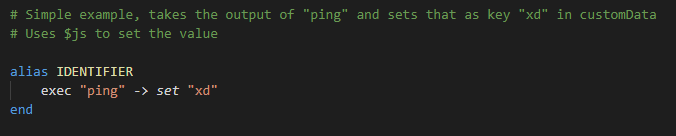
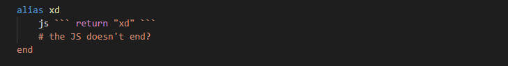

# supibot-language-support README

This extention provides syntax highlighting for Supibot Language (SBL) or "supilang".

## Features

Syntax highlighting for `.sbl` (Supibot Language) files.

## Requirements

None?

## Extension Settings

None

## Known Issues

Currenly the only known issue is when JS is one line, the highlighting gets broken. Its recommended to just use more than one line.

Also, just add a semi-colon.
## Release Notes

None
